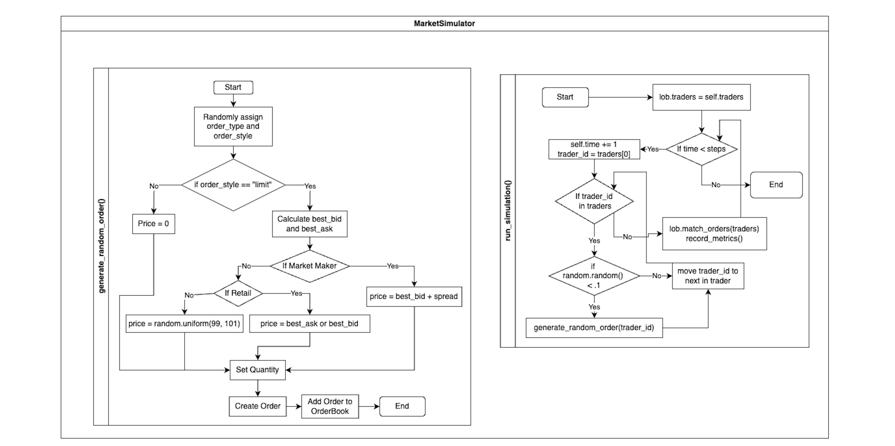

# Term Project - Market Simulation

Jake Baker

March 2025

---

# Executive Summary

- Simplification of the stock market involving Market Makers, Institutional Investors, and Retail Traders
- The stock market is an incredibly complex system influenced by countless factors, from global economics to individual investor sentiment. This simulation aims to isolate and examine key interactions, focusing on quantity and spread
- It employs an agent-based approach, where the agents represent the three aforementioned trader groups
- The goal of this simulation is to analyze potential advantages for each trader category and to investigate the impact of Market Orders versus Limit Orders on profitability

---

# Term Definitions

- **Market Maker:** An entity that provides liquidity to the market by continuously quoting buy and sell prices. They often act as the "bank" and are **Price Makers**
    - Makes money on the **Spread**
- **Institutional Investor:** A large entity, such as a mutual fund or pension fund, that trades significant volumes of securities. Sometimes large enough that their actions can move the market
- **Retail Trader:** An individual investor who buys and sells securities for personal profit. They are **Price Takers**
- **Market Order:** An order to buy or sell a security at the best available current price
- **Limit Order:** An order to buy or sell a security at a specific price or better

---

# Market Maker's Spread
- Difference between Buyer's buy price and Seller's sell price
- A wider spread means there is less liquidity in the market
- **Order Book** tracks the sell and buy prices for incoming orders

---
# Market Maker's Spread Visualized

---
# Model Overview

- Traders place orders (buy or sell, market or limit) for a specified number of holdings.
    - Orders have randomized parameters according to their type and who is placing them
- These orders are added to an Order Book, awaiting a matching order of the opposite type.
- When a match is found, the order is fulfilled, and shares and funds are exchanged.
- Track metrics such as Balance, Profit, and Profit from Market Order trades and Profit from Limit Order trades

---

# High Level Model

---

# Generate Random Order

---

# Execute Trade

---

# Simulation Model
- Perform 100,000 simulations with 10,000 time steps each
    - Each time step has a 10% chance of generating a trade for a given trader
- Randomize the number of traders between 4 and 100 for each simulation
    - Only requirement is at least one Market Maker
    - 2% chance of a Market Maker, 28% of a Institutional Investor, and 70% of a Retail Investor
- Aggregate results of each simulation into one data structure

---

# Results

---

